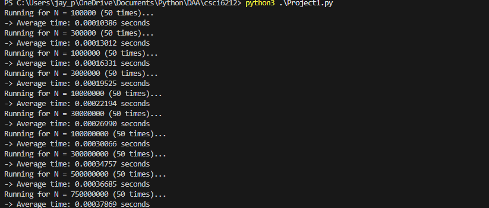
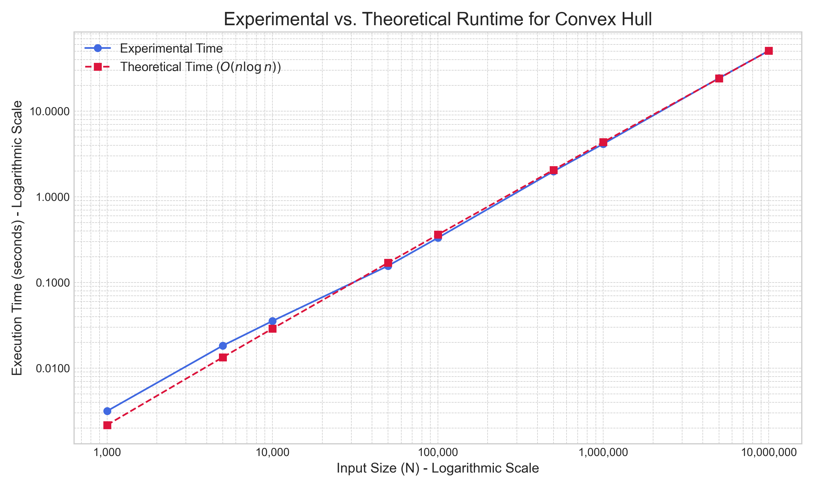
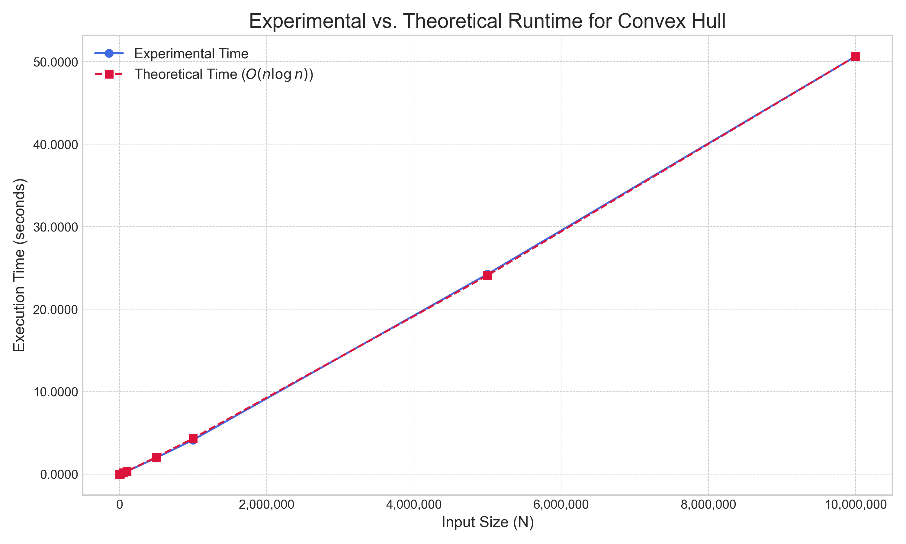

# csci6212
### Project 2:

Used Python 3.13
Packages Used:
- matplotlib
- unittest

### Project 2 - Time Complexity is Θ (N log N)

### Running the Unit Tests
To run the included test suite, navigate to the project directory in your terminal and execute the following command:

```
python -m unittest test_convex_hull.py
```

#### Unit Test Cases
The test file test_convex_hull.py includes several cases to verify the algorithm's correctness:

- Interior Points: A test to ensure points inside the hull are correctly excluded.

- Collinear Points: Edge cases for points lying on the same horizontal or vertical line.

- Small Inputs: Verifies behavior for inputs with fewer than three points.

### Project 2 Output via Code:



### Project 2 Graph Generated via Code:

Log-Log


Normal

