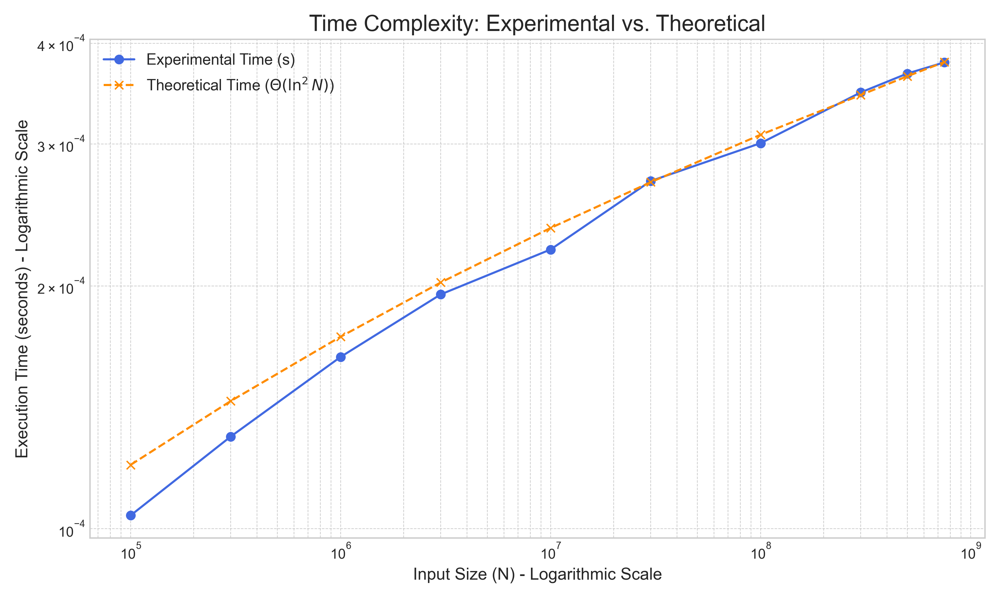

# csci6212
## Project 1:

Used Python 3.13

Packages Used:
- numpy
- matplotlib

### Project 1 - Time Complexity is Θ (Log ^2 n)

### Project 1 Output via Code:

### Project 1 Graph Generated via Code:

